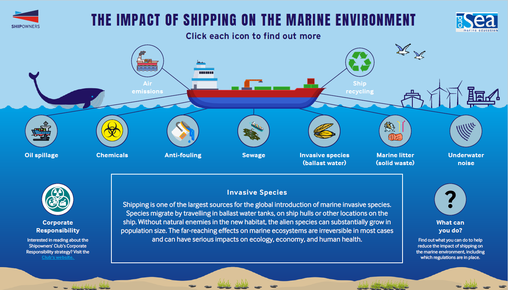
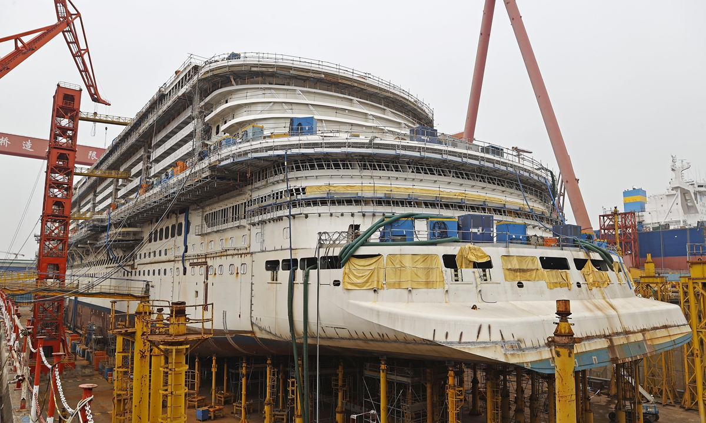
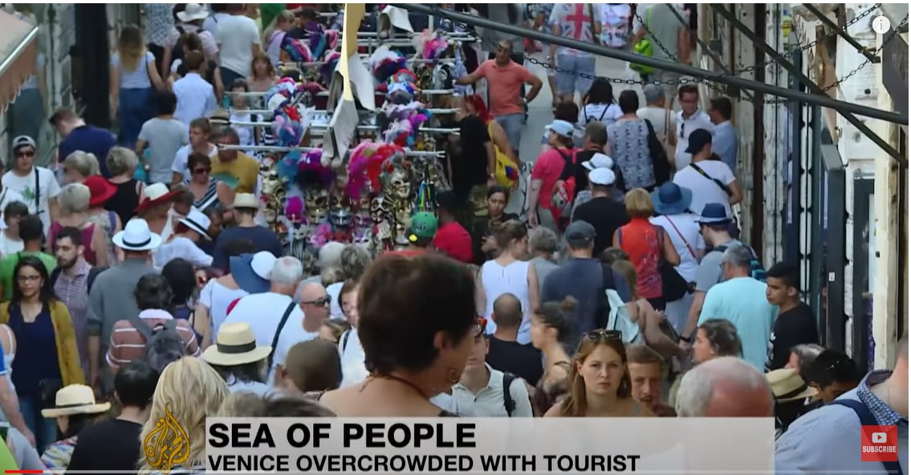
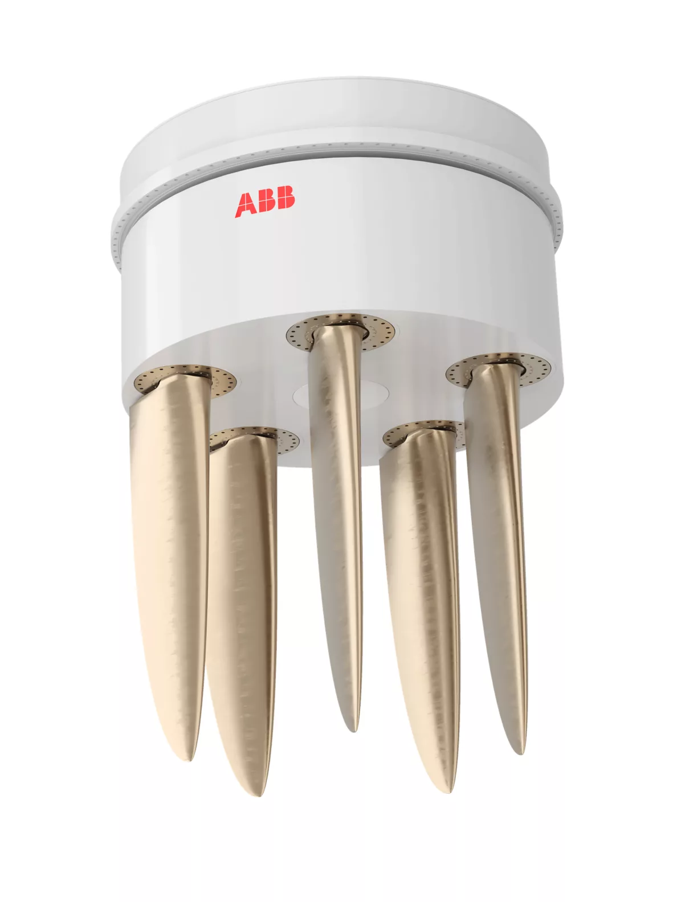
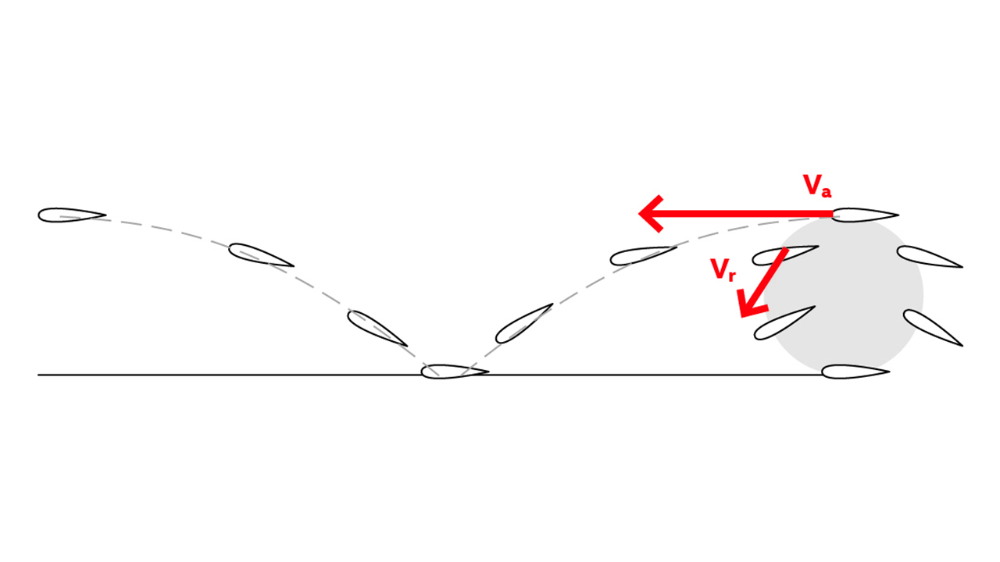
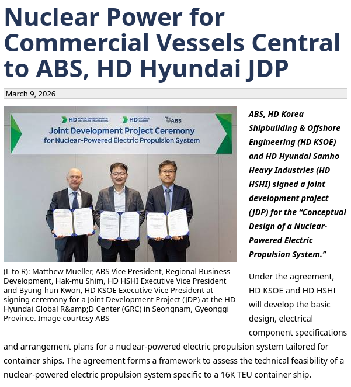
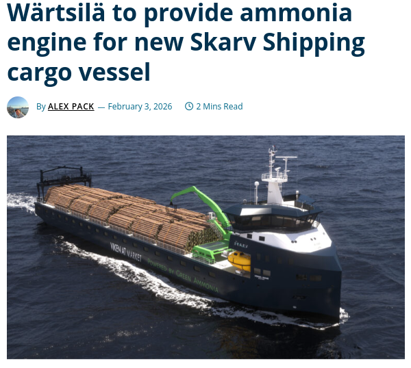
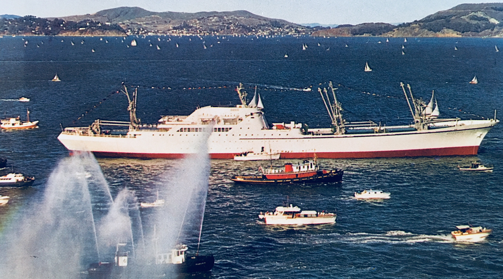
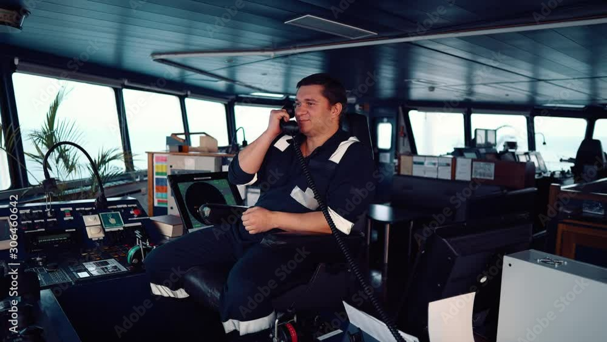

#+TITLE: Tekniska och andra Lösningar för att minska sjöfartens miljöeffekter
#+SUBTITLE: Tekniska och andra åtgärder i och runt fartyget
#+AUTHOR: Kim Alfredsson
#+DATE: 2026-04-14
#+OPTIONS: toc:nil num:nil
#+REVEAL_TRANS: none
#+REVEAL_THEME: simple
#+REVEAL_HLEVEL: 2
#+OPTIONS: reveal_title_slide:nil

* Tekniska och andra lösningar på sjöfartens miljöeffekter
#+BEGIN_NOTES
Presentation av mig själv: Varit till sjöss i snart 25 år, gick här på skolan mellan 2009-2012. Spenderat de sista 7 åren på kryssning.
#+END_NOTES
** Utgångspunkt
- Global och lokal påverkan av miljön
- Teknik som lösning på miljöproblem?

  #+BEGIN_NOTES
  - Sjöfarten har stor påverkan på miljön, globalt som lokalt.
  - Direkt påverkan som oljeutsläpp
  - Indirekt påverkan i form av saker som förändrade livsmiljöer, introduktion av främmande arter, skeppsbyggnad etc.
  - Vi kommer inte ifrån att om vi ska flytta varor globalt så kommer miljön att påverkas, på ett eller annat sätt.
#+END_NOTES

** Fråga att ha i bakhuvudet
- Vad är det som driver *implementeringen* av miljöeffektsminskande teknik?
#+BEGIN_NOTES
Håll det här lite i bakhuvudet. Vad är det som gör att redarna öppnar sina plånböcker? Vilka problem är det en redare löser när man implementerar den här tekniken?
#+END_NOTES
* Vilka miljöeffekter pratar vi om?
** Exempel på effekter

#+BEGIN_NOTES
- Det här är nog en bild som är välbekant så ska inte dröja kvar vid den.
- Oljespill från olyckor, medvetet, teknikfel, tankrengöringar etc
- Kemikalier; olyckor, spill av andra orsaker, mikroplaster från gråvatten etc.
- Bottenfärg; koppar, zink, partiklar etc.
- Svartvatten; näring, bakterier, medicinrester
- Ballastvatten; främmande arter
- Diverse annat skräp i fast form, food waste; något som blir mer och mer fokus på olika håll
  kan tyckas att det är en rätt obetydlig sak i sammanhanget: ge exempel på mängd food waste per person på en kryssningsbåt; och food waste i GW.
- Buller, både ovan och under ytan; kavitation, ekolod
- Diverse luftföroreningar; NOx SOx, Co2, partiklar, "boil-off från LNG last"
#+END_NOTES
** Det finns fler
#+ATTR_HTML: :style display:inline-block; width:45%; margin-right:2%;

#+ATTR_HTML: :style display:inline-block; width:45%;

#+BEGIN_NOTES
- Skeppsbyggnad; enorma resurser som används; ni kan ju tänka er vad som krävs för att bygga ett av de största kryssningsmonstren
- Andra bilden representerar något jag själv tycker är rätt viktigt; Kulturella och estetiska miljöeffekter; nog så viktigt. Om någon av er bor på Öland så tror jag ni förstår. Det vi har där är ingenting mot Venedig, där bilden är från, eller Dubrovnik. Påverkan massturism har i små samhällen är omfattande.
- Med detta har vi också ljus- och ljudföreoreningar; något man bland tex i Adriatiska havet har identifierat och börjat arbeta med; kryssningsfartyg får inte ankra på vissa ställen, man diskuterar begränsningar likt de i Venedig etc.
- kölvatten, uppdragning av sediment
#+END_NOTES
** Tekniska lösningar - luft / GHG
- Alternativa bränslen (MGO/VLSFO, LNG, metanol, vätgas, kärnkraft, el, m.fl.)
- Nya framdrivningskoncept, effektivare propellrar, vindkraft
- Avgasrening: SCR, EGR, partikelfilter, scrubbers
- Waste heat recovery, axelgeneratorer, hybriddrift
- Effektivare fläktar, pumpar, belysning, HVAC etc.
- Landström

 #+BEGIN_NOTES
- MGO, LNG, eldrift för mindre fartyg; mer exotiska drivmedel som ammoniak och vätgas som är under utveckling; kärnkraft finns förstås men ligger 70 år efter utvecklingsmässigt.
- Framdrivning: ABB Dynafin som är ett helt nytt koncept baserat på hur valar förflyttar sig, Oceanbird som utvecklar segel, inte ett nytt koncept kanske, men inte använt i någon större skala sedan oljekrisen på 70-talet. Nya propellrar där ubåtar driver utvecklingen.
- SCR och EGR för att reducera NOx: EGR är avgasåterföring: avgaser återförs till insug för att sänka förbränningstopptemp, SCR urea.
- Scrubbers är en lösning på svavelutsläpp som sen blev ett problem innan man började med slutna system; man flyttade utsläppet till vattnet.
- Landström som det experimenteras lite med här och där: kommer bli mer pga förväntade nya EU-regler
- Alla utom kanske avgasrening är egentligen sånt som minskar bränsleförbrukingen i första hand; och på så sätt minskar CO2.
 #+END_NOTES
*** ABB Dynafin
#+ATTR_HTML: :width 35% :align left

#+ATTR_HTML: :width 45% :align right

*** Alternativ

#+ATTR_HTML: :width 35% :align left

#+ATTR_HTML: :width 45% :align right

*** Savannah

** Tekniska lösningar - vatten
- Moderna typer av antifouling
- BWTS - ballast treatment

#+BEGIN_NOTES
- händer en hel del: standard idag är främst koppar- och zinkbaserad bottenfärg. Självpolerande, silikonbaserade. Biologisk komponent utan biocider utvecklas. Man tittar i naturen på vad som inte drabbas av påväxt och försöker efterapa på syntetisk väg. Silverbaserade, men mig veterligen är detta inget som används än.
- bwts är väl mer eller midre en standard idag.
#+END_NOTES

** Tekniska lösningar - olje- och kemikaliespill
- Oljeseparatorer, white box
- Slutna system
- Moderna navigationssystem, ruttplaneringsverktyg etc.
- Strikta rutiner vid bunkring, läktring etc.

** Sewage, GW, Food waste
- Advanced Waste Water Treatment eg. MBR
- Digesters/dehydrator

#+BEGIN_NOTES
- Advanced waste water treatment börjar så smått bli standard inom kryssning, men resterande är långt efter. ~80% av fartygen med i CLIA
- Gråvatten är idag inte reglerat men fokus på detta har ökat de sista åren, främst när man pratar om kryssningsfartyg. En stor källa av rätt okontrollerade utsläpp: food waste i gråvatten via digesters. En del digesters har filter som hindrar bland annat mikroplaster att försvinna ut.
#+END_NOTES

** Buller, "estetiska"-föroreningar
- Kapsling, ljuddämpning
- Framdrivningssystem ( eg. rimdrive )
- Fläktar, lastutrustning, HVAC

#+BEGIN_NOTES

#+END_NOTES

** Diskussionsfråga
- Vad är det som driver *implementeringen* av miljöeffektsminskande teknik?

* Incitament - vilka problem löser egentligen redaren?

#+BEGIN_NOTES
- Vi människor agerar efter incitament: Är vi hungriga söker vi mat, behöver vi bekräftelse laddar vi ner Tinder, vi skyddar oss när vi upplever risk.
- Ett bolag fungerar på samma sätt. Skillnaden är att vi människor har ett rätt stort spann av ansvar, saker vi tycker är viktiga; ett aktiebolags hela syfte är att tjäna pengar till aktieägarna, det är den stora drivkraften och de flesta incitament leder åt det hållet. Samtidigt ska vi komma ihåg att ett aktiebolag i sin tur består av individer, med sina egna agendor.
#+END_NOTES

** Kapital och compliance
- Kostnader och vinster (eller missade vinster)
- Efterföljnad av regelverk, befintliga och kommande
- Risk

#+BEGIN_NOTES
- Ökande bränslekostnader, hamnavgifter med reduktion om man är klassad högt i Clean Shipping Index. (Göteborgs hamn reducerar hamnavgift med 90% för de med högst klassning)
- Man försöker tänka på framtiden, bygger man en båt man planerar köra med i 15-20 år så är det en stor risk att bygga helt konventionellt.
- Risk för rykte: kryssning extremt känsligt här; man vill inte ha några negativa headlines om hur man skiter i miljöfrågor. Oavsett om man egentligen bryr sig så mycket så är risken att sätta ribban lågt väldigt hög, när de flesta andra sätter den högre. Det driver sig självt.
#+END_NOTES

** Sett historiskt: Regelverk -> tekniska lösningar
- MARPOL/OPA 90 -> omställning av tankflottan
- Förbud mot TBT -> nya bottenfärger
- Svaveltak -> Scrubbers, LNG-drift
- IMO Tier II och III -> EGR, SCR
- EEDI/EEXI -> nya bulbformer, vindassistans, energiövervakningssystem

 #+BEGIN_NOTES
- MARPOL: drev en omfattande omställning av den globala tankflottan, mot dubbelskrov
- Svavel: Scrubbers, sen vidare till slutna system, LNG drift tex i Östersjön (Viking Line)
- IMO Tier II: Driver också utveckling av nya generationer av motorer som effektivare minskar NOx
- Det är idag mycket tryck på fartygsägare, man vet inte riktigt vad som ska komma, agenda 30 (FN CO2 neutralt 20230, som nu flyttats framåt), så man investerar i alterntiva lösningar, mycket för att mitigera risk. EEDI-tal driver också att man bygger fartyg som är mer effektiva. Miljövänligt eller inte går att diskutera, men lägra CO2-utsläpp under drift iallafall.
 #+END_NOTES

** Utöver tvingande regelverk
- Varumärke; risk, kapital, teknik före minimikrav
- CLIA, IAATO, AECO, CSI; frivilliga standarder
- Klassnoteringar: DNV Clean Design, LR ECO
- Krav från charter, lastägare, lokala regler

#+BEGIN_NOTES
- Kryssningsindustrin har till stor del valt att lägga sig i förkant. Incitament finns för att göra det; risken att inte göra som sina konkurenter är hög, känsligt för negativa nyheter. Kostnaden av att få negativ press är hög. För en del är det en del av varumärket, för andra är det något man känner sig tvungna att göra för att konkurenterna gör det.
- Man har tillsammans infört standarder genom sammanslutningar bolagen emellar: CLIA (95% av global kapacitet) som bland annat sätter utsläppsgränser och teknikkrav; IAATO och AECO som sätter guidelines för operationer i Antarktis och Arktis; CSI=Clean Shipping Index, som är en egen organisation och mer allmän, man kan välja att klassa fartyg vilket ger en del fördelar som minskade hamnavgifter <- återigen incitament.
- Olika klassnoteringar, DNVs Clean Design, Loyds ECO. Klassnoteringar som sätts vid nybyggnation.
#+END_NOTES

* Sjömannens roll

** Vad händer ombord?
- Ny teknik - kul!
- Nya regelverk leder till implementering av nya rutiner
- Administration - mindre kul!
- Compliance, compliance, compliance

 #+BEGIN_NOTES
- Ny teknik har alltid påförts; och sjömännen har anpassat sig. Anpassningen av ny teknik går ofta långsammare än införandet av den. Här är en flaskhals.
- Compliance: CBTer, kurser, utbildningar som ska avslutas med en signatur etc. Kommer av att redaren krävs av försäkringsgivaren att han ska ha gjort sin "due diligence". Många rederier löser det på detta sätt.
 #+END_NOTES

** Vad förväntas och vad kan göras ombord
- Regelefterlevnad
- Fart, trim, lastfördelning, mjukare manövrering
- Optimering av last på huvudmaskin och generatorer
- Rutiner, kunskap, mentorsskap, yrkesstolthet
- Underhåll
- Rapportera avvikelser

#+BEGIN_NOTES
- Rapportera: Använd rapporteringssystemen som det är tänkt att användas; inte som dina kollegor allt för ofta gör; fånga upp svårarbetat utrustning, orimliga arbetsmiljöproblem som kommer av följd etc.
- Mentorskap: hjälp nya att se miljödelen som en integrerad del i driften, inte bara "pappersarbete". Här tror jag dock problemet många gånger är den äldre generationen.
- Yrkesstolthet; att en del av vårt jobb ska vara att lämna ett så litet spår som möjligt; att förmedla detta till nya
#+END_NOTES

** Sammanfattning
#+BEGIN_NOTES
- Det finns en hel del tekniska lösningar som minskar många av de miljöeffekter sjöfarten ger, fler utvecklas hela tiden
- Incitament driver utvecklingen
- Historiskt sett har regler kommit först -> utveckling sen
#+END_NOTES
